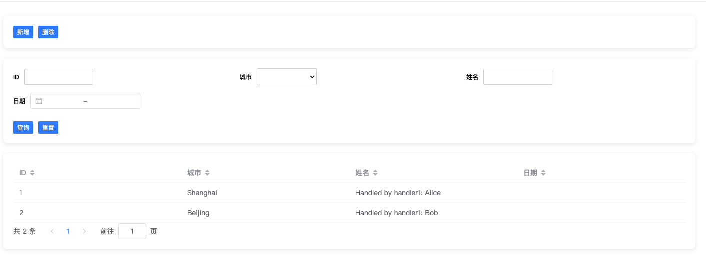

# list_view_v2

## 简介
一个简单的列表数据加载工具,通过读取配置文件,自动生成列表页面,支持**分页**,**排序**,**搜索**等功能



## 使用方式
### 1. 配置
在public文件夹下创建list_config.json文件：
#### 示例文件
- 主列表视图：[list_config.json](public/list_config.json)
- 子列表视图：[sub_list_config.json](public/sub_list_config.json)
#### 配置说明
[config_usage.md](public/config_usage.md)

### 2. 实现自定义方法
基于配置的内容有一些自定义方法需要实现，src/components/utils文件夹中，可以根据需要自行实现

#### [auth_handler.js](src/components/utils/auth_handler.js)
- 该文件用于定义接口的鉴权逻辑

#### [customer_field_handler.js](src/components/utils/customer_field_handler.js)
- 该文件用于定义自定义字段的展示逻辑
- 该文件中的方法会在列表展示时调用

#### [tools_handler.js](src/components/utils/tools_handler.js)
- 该文件用于定义工具栏按钮的点击逻辑

### 3. 启动项目
```shell
npm install
npm serve
```
