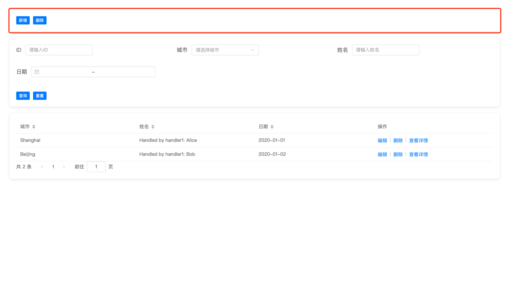
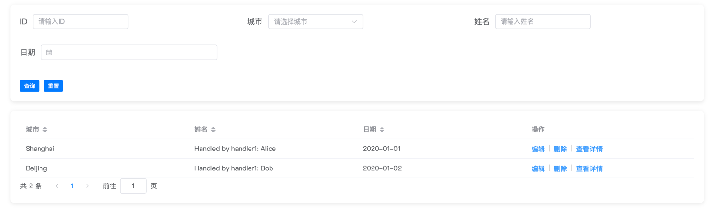

# 通用列表页面使用说明文档

本文档介绍了如何使用配置文件来加载一个通用的列表页面。配置文件中的字段将逐一介绍，并保留嵌套结构。

## 通用字段
| 字段            | 说明     | 示例                    |
|:--------------|:-------|:----------------------|
| `title`       | 页面的标题  | `"title": "测试"`       |
| `is_pageable` | 是否支持分页 | `"is_pageable": true` |

## `tools`部分
- tools是页面工具按钮配置，包含了按钮的类型、标签、样式类型和配置。
- tools的配置是一个数组，每个元素是一个按钮配置。
- 目前支持执行自定义的js方法和新建、编辑、详情弹窗组件



### 弹窗按钮
| 字段           | 说明                                                                          | 示例                              |
|:-------------|:----------------------------------------------------------------------------|:--------------------------------|
| `type`       | 按钮类型,仅支持button                                                              | `"type": "button"`              |
| `label`      | 按钮名称                                                                        | `"label": "新增"`                 |
| `style_type` | 按钮类型:<br/>`create_dialog` 新增弹窗 <br/>`edit_dialog` 编辑弹窗<br/>`sub_list` 子列表弹窗 | `"style_type": "create_dialog"` |
| `config`     | 弹窗配置                                                                        | `"config": {...}`               |
#### config
- config是弹窗的配置，包含了请求的url、请求的方法、请求的参数等。

| 字段    | 说明           | 示例             |
|:------|:-------------|:---------------|
| `req` | 请求配置，点击提交时请求 | `"req": {...}` |

##### req
- req是请求的配置，包含了请求的url、请求的方法、请求的参数等。

| 字段        | 说明           | 示例                                      |
|:----------|:-------------|:----------------------------------------|
| `url`     | 请求的url       | `"url": "http://localhost:8088/create"` |
| `method`  | 请求的方法        | `"method": "post"`                      |
| `columns` | 新建窗口中需要渲染的表单 | `"columns": {...}`                      |

##### columns
- columns是新建窗口中需要渲染的表单，包含了表单的字段、类型、字典等。
- key是字段名，value是字段的配置。

| 字段          | 说明                         | 示例                    |
|:------------|:---------------------------|:----------------------|
| `label`     | 字段的标签                      | `"label": "姓名"`       |
| `type`      | 表单类型：text/select/read_only | `"type": "select"`    |
| `dict_bind` | 字典绑定，如果是select类型，需要绑定字典    | `"dict_bind": "name"` |

示例
```json
{
            "type": "button",
            "label": "新增",
            "style_type": "create_dialog",
            "config": {
                "req": {
                    "url": "http://localhost:8088/create",
                    "method": "post",
                    "columns": {
                        "name": {
                            "label": "姓名",
                            "type": "select",
                            "dict_bind": "name"
                        },
                        "city": {
                            "label": "城市",
                            "type": "select",
                            "dict_bind": "city"
                        }
                    }
                }
            }
        }
```

### 自定义方法按钮

- 调用utils/tools_handler.js中的方法
- 需要在tools_handler.js中实现对应的方法

| 字段           | 说明                               | 示例                               |
|:-------------|:---------------------------------|:---------------------------------|
| `type`       | 按钮类型,仅支持button                   | `"type": "button"`               |
| `label`      | 按钮名称                             | `"label": "自定义方法"`               |
| `style_type` | 按钮类型:<br/>`custom_handler` 自定义方法 | `"style_type": "custom_handler"` |
| `config`     | 弹窗配置                             | `"config": {...}`                |
#### config
- config是自定义方法的配置，包含了方法名。

| 字段       | 说明  | 示例                      |
|:---------|:----|:------------------------|
| `method` | 方法名 | `"method": "function1"` |

示例：
```json
{
            "type": "button",
            "label": "自定义方法",
            "style_type": "custom_handler",
            "config": {
                "method": "function1"
            }
        }
```

## `dict`部分
- `dict` 是字典配置，用于绑定选择框等。可以是静态数据或通过请求动态获取的数据。

### 字典配置
| 字段       | 说明                             | 示例                       |
|:---------|:-------------------------------|:-------------------------|
| `source` | 字典来源                           | `"source": "req"`        |
| `type`   | 字典类型                           | `"type": "label_value"`  |
| `req`    | 请求配置，若 `source` 为 `req` 时必填    | `"req": {...}`           |
| `data`   | 静态数据，若 `source` 为 `static` 时必填 | `"data": [{...}, {...}]` |

#### req
- `req` 是请求的配置，包含了请求的 URL、请求的方法、请求的参数等。

| 字段       | 说明      | 示例                                    |
|:---------|:--------|:--------------------------------------|
| `url`    | 请求的 URL | `"url": "http://localhost:8088/city"` |
| `auth`   | 认证方式    | `"auth": "defaultAuth"`               |
| `method` | 请求的方法   | `"method": "GET"`                     |
| `params` | 请求参数    | `"params": {"conditions": "city"}`    |

### 示例
```json
{
    "city": {
        "source": "req",
        "type": "label_value",
        "req": {
            "url": "http://localhost:8088/city",
            "auth": "defaultAuth",
            "method": "GET",
            "params": {
                "conditions": "city"
            }
        }
    },
    "name": {
        "source": "static",
        "type": "label_value",
        "data": [
            {
                "label": "张三",
                "value": "1"
            },
            {
                "label": "李四",
                "value": "2"
            }
        ]
    }
}
```

## `level_config`部分
- `level_config` 是层级配置，定义了列表页面的列配置和请求配置。



### 列配置
| 字段                | 说明     | 示例                         |
|:------------------|:-------|:---------------------------|
| `label`           | 列标签    | `"label": "ID"`            |
| `is_hint`         | 是否提示   | `"is_hint": true`          |
| `filter_field`    | 过滤字段配置 | `"filter_field": {...}`    |
| `is_support_sort` | 是否支持排序 | `"is_support_sort": true"` |
| `order`           | 排序顺序   | `"order": 1"`              |
| `tools`           | 操作工具配置 | `"tools": [{...}, {...}]`  |

#### filter_field
- `filter_field` 是过滤字段配置，包含了字段的类型、占位符等。

| 字段            | 说明                          | 示例                       |
|:--------------|:----------------------------|:-------------------------|
| `type`        | 字段类型                        | `"type": "text"`         |
| `placeholder` | 占位符                         | `"placeholder": "请输入ID"` |
| `dict_bind`   | 字典绑定，如果是 `select` 类型，需要绑定字典 | `"dict_bind": "city"`    |

### 操作工具配置
- `tools` 是操作工具配置，包含了按钮的类型、标签、样式类型和配置。

| 字段           | 说明                                                                             | 示例                            |
|:-------------|:-------------------------------------------------------------------------------|:------------------------------|
| `type`       | 按钮类型，仅支持 `button`                                                              | `"type": "button"`            |
| `label`      | 按钮名称                                                                           | `"label": "编辑"`               |
| `style_type` | 按钮类型:<br/>`edit_dialog` 编辑弹窗 <br/>`custom_handler` 自定义方法 <br/>`sub_list` 子列表弹窗 | `"style_type": "edit_dialog"` |
| `config`     | 按钮配置                                                                           | `"config": {...}`             |

#### config
- `config` 是按钮的配置，包含了请求的 URL、请求的方法、请求的参数等。

| 字段    | 说明           | 示例             |
|:------|:-------------|:---------------|
| `req` | 请求配置，点击提交时请求 | `"req": {...}` |

##### req
- `req` 是请求的配置，包含了请求的 URL、请求的方法、请求的参数等。

| 字段        | 说明           | 示例                                    |
|:----------|:-------------|:--------------------------------------|
| `url`     | 请求的 URL      | `"url": "http://localhost:8088/edit"` |
| `method`  | 请求的方法        | `"method": "post"`                    |
| `columns` | 新建窗口中需要渲染的表单 | `"columns": {...}`                    |

##### columns
- `columns` 是新建窗口中需要渲染的表单，包含了表单的字段、类型、字典等。
- key 是字段名，value 是字段的配置。

| 字段          | 说明                               | 示例                    |
|:------------|:---------------------------------|:----------------------|
| `label`     | 字段的标签                            | `"label": "姓名"`       |
| `type`      | 表单类型：`text`/`select`/`read_only` | `"type": "select"`    |
| `dict_bind` | 字典绑定，如果是 `select` 类型，需要绑定字典      | `"dict_bind": "name"` |

### 示例
```json
{
    "columns": {
        "id": {
            "label": "ID",
            "is_hint": true,
            "filter_field": {
                "type": "text",
                "placeholder": "请输入ID"
            },
            "is_support_sort": true,
            "order": 1
        },
        "city": {
            "label": "城市",
            "is_hint": false,
            "filter_field": {
                "type": "select",
                "dict_bind": "city",
                "placeholder": "请选择城市"
            },
            "is_support_sort": true,
            "order": 1
        },
        "name": {
            "label": "姓名",
            "is_hint": false,
            "handler": "handler1",
            "filter_field": {
                "type": "text",
                "placeholder": "请输入姓名"
            },
            "is_support_sort": true,
            "order": 2
        },
        "date": {
            "label": "日期",
            "is_hint": false,
            "filter_field": {
                "type": "date_range",
                "format": "YYYY-MM-DD"
            },
            "is_support_sort": true,
            "order": 3
        },
        "options": {
            "label": "操作",
            "tools": [
                {
                    "type": "button",
                    "label": "编辑",
                    "style_type": "edit_dialog",
                    "config": {
                        "req": {
                            "url": "http://localhost:8088/edit",
                            "method": "post",
                            "columns": {
                                "id": {
                                    "label": "ID",
                                    "type": "read_only"
                                },
                                "name": {
                                    "label": "姓名",
                                    "type": "select",
                                    "dict_bind": "name"
                                },
                                "city": {
                                    "label": "城市",
                                    "type": "select",
                                    "dict_bind": "city"
                                },
                                "date": {
                                    "label": "日期",
                                    "type": "date_range"
                                }
                            }
                        }
                    }
                },
                {
                    "type": "button",
                    "label": "删除",
                    "style_type": "custom_handler",
                    "config": {
                        "method": "function1"
                    }
                },
                {
                    "type": "button",
                    "label": "查看详情",
                    "style_type": "sub_list",
                    "config": {
                        "config_path": "sub_list_config.json",
                        "method": "function1"
                    }
                }
            ]
        }
    },
    "req": {
        "url": "http://localhost:8088/post",
        "method": "POST",
        "params": {
            "page": 1,
            "size": 10
        }
    }
}
```